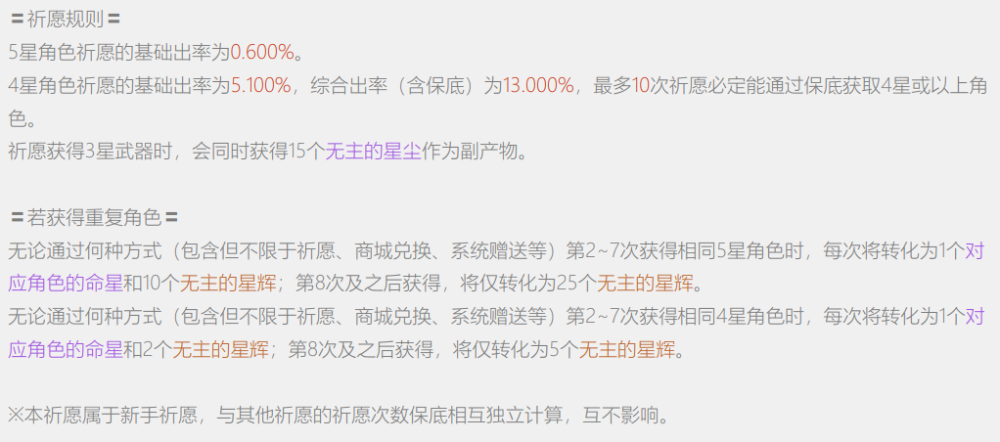
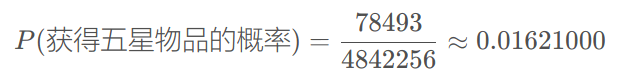
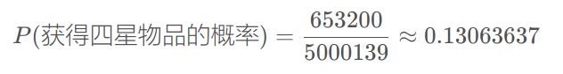
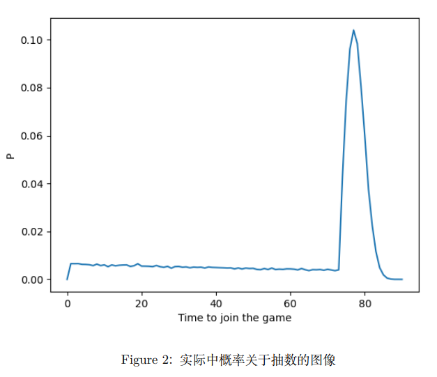
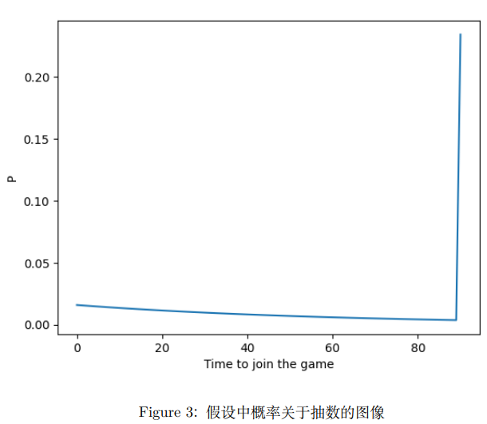
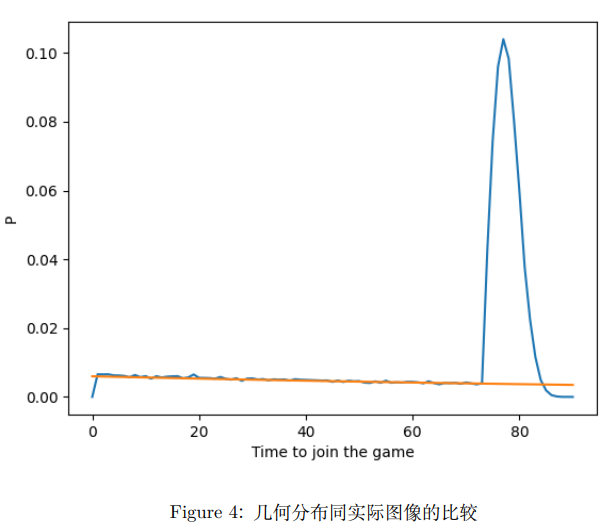

<!---more-->

## 背景

目前在市面上出现了大量以抽奖为核心盈利手段的电子游戏，在这种游戏中，获取
游戏中的物品不是明码标价的购买，而是通过参加某种抽奖性质的活动。玩家花费一定
金额购买参加活动的机会，每次参加都有一定的概率获得玩家想要获得的物品。在抽奖
活动中，游戏设计者还会引入一种被称为 “保底” 的游戏机制：开发者向玩家群体承诺
在一定的参加次数之后必然会获得到该物品。例如下面是热门游戏《原神》中获取游戏
中角色 “抽奖” 活动的概率公示页面。

在这个 “抽奖” 活动中，玩家可以得到三种等级的物品，在游戏中分别称为 “五星物品”、“四星物品” 和 “三星物品”。在每次的 “抽奖” 活动中，玩家必定会获得上述三种物品中的一种。为了简化问题的讨论，我们现不区分相同等级不同物品之间的不同，只考虑不同星级物品的获取概率。通过概率公示可以知道：五星物品的 “基础概率” 为0.600%，四星物品的 “基础概率” 为 5.100%；五星物品的 “综合概率” 为 1.600%，四星物品的 “综合概率” 为 13.000%。从一个玩家的角度出发，自然会存在两个问题：

- 什么是“基础概率”，什么是“综合概率”？

- 游戏中的实际概率和公式概率吻合吗？

## 研究方法

在大量的重复实验中，事件 A 发生的频率往往具有稳定性，随着重复实验次数的增加，事件发生的频率逐渐稳定于某个固定的客观的常数。由于大数定理，频率最终会收敛到概率。因此，可以通过大量玩家参与这个 “实验” 的数据来回答上述的问题。

### 数据的获取

一般而言，游玩游戏的玩家只能看见自己过往参加游戏时的记录，但是在一些第三方平台上允许其他玩家主动上传数据并公示给大家。虽然这些第三方平台上数据不能完全保证可靠性，可以通过统计中筛选删除明显错误和容易对结果产生较大影响的数据，即使仍然存在少量的错误数据也不会对结果产生比较明显的影响。这里采用[OneBST](https://github.com/OneBST)从第三方平台 [“非小酋” 网站](https://feixiaoqiu.com)获取的截至 2022 年 7 月 26 日的数据作为数据集。

> 数据可以在[Github仓库](https://github.com/OneBST/GI_gacha_dataset/)中下载。

### 数据的统计和分析

利用 Python 中的 Numpy 和 Pandas 等工具包对获取到的数据进行统计分析，在对获取到的数据进行分析的过程中按照以下的规则排除明显错误和对结果影响比较大的数据：

- 抽卡中多次出现违反“保底”规则的数据，例如多次获得“四星”物品的间隔超过10次。

- 数据中应该唯一的字段“gacha_id"大量重复。

- 第一次获得四星或者五星物品。

- 数据本身的错误。

## 结论

### 综合概率的解释

在总共 4842256 次抽卡记录中，获得五星物品的次数为 78493 次，于是：

再计算一下每次参加该活动获得四星物品的平均概率：在总共 5000139 次抽卡中，获得四星物品的次数为 653200：

不难发现，在误差允许的范围内，计算出来的平均概率和游戏开发者所公布的 “综合概率” 是相同的。当参与这个游戏足够多次时，获取到五星物品和四星物品的数量就可以用这个概率来估计。

### 抽卡过程的数学描述

为了方便讨论，再次将这个 “游戏” 简化为获得五星物品和不获得五星物品两种情况。那么这个 “抽奖” 游戏是否就能被简化为一个概率为 1.6% 的 n 次伯努利实验？不妨假设每次获得五星物品之间相互独立，这样每次获得五星物品都可以认为是首次获得五星物品，这时参加该游戏的次数就会符合概率为 1.6% 的几何分布，而为了符合保底规则，当玩家在参与到第 90 次时仍未获得五星物品，强制给予玩家一个五星的物品。画出实际数据中得到的图像和按照几何分布得到的图像。

不难发现假设的猜想和实际情况不相符合。在抽数小于 73 抽时，获得五星物品的概率逐渐降低，从 0.6% 左右一直降低至 0.4% 左右。当抽数大于等于 73 抽时，抽到的概率开始上升，在抽数等于 77 抽时达到最大，大约为 10.4%。随后概率开始下降，在第 91 抽时，概率等于 0。

如果在实际得到的概率关于抽数的图上再作出概率为 0.6% 的几何分布的图像，前73 抽的概率图像和几何分布的图像几乎吻合。也就是说，该抽奖游戏的前 73 抽就是一个符合 P = 0.6% 的几何分布，从第 73 抽开始 “保底” 机制的修正。这就是游戏开发者口中 “基础概率” 的含义：在该抽奖游戏的前数十抽就是一个概率为 0.6% 的伯努利实验。

从大量的实际数据出发，不难发现游戏开发者的申明同实际情况相吻合。

## 不足和展望

### 获取五星物品相互独立的假设

直到作者开始写作本文之前，作者都没有意识到本文 3.2 节中的所有结论几乎都基于该假设。限于文章的篇幅原因和个人的能力问题，在本文中未对这个假设作出验证。下面给出一种验证该猜想的方法。为验证获得五星物品之间相互独立，可以通过统计方法验证下面的等式成立。

### 展望

在获得概率和抽数之间的相关关系之后，可以将这个抽卡的过程当作一个随机过程进行分析，并且求出相关的数学特征。从玩家的角度出发，可以指导玩家使用比较合理的策略参加这个游戏，从而以比较低的代价获得自己心仪的物品。从游戏开发者的角度出发，则有有利于优化自己游戏中的概率设计，吸引更多的玩家参与到游戏中来。
